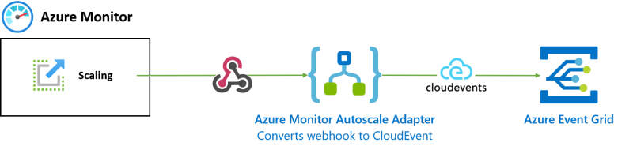

# Azure Event Grid adapter for Azure Monitor Autoscale

Bring Azure Monitor Autoscale events to Azure Event Grid with this adapter.

[](https://portal.azure.com/#create/Microsoft.Template/uri/https%3A%2F%2Fraw.githubusercontent.com%2Ftomkerkhove%2Fazure-monitor-autoscale-to-event-grid-adapter%2Fmain%2Fdeploy%2Fazuredeploy.json%3Ftoken%3DABBE6P7H5UGZSWVS67TSABTAFQL46)

## How Does It Work?

An Azure Logic Apps workflow is used to receive the webhooks, interpret them and convert it to a CloudEvent.



## Supported Events

- Scale In Activated
- Scale Out Activated

### Scale In Activated

**Event Type:** `Azure.Monitor.Autoscale.ScaleIn.Activated`

<details>
<summary><b>Payload</b></summary>

```json
{
    "specversion": "1.0",
    "type": "Azure.Monitor.Autoscale.ScaleIn.Activated",
    "id": "A234-1234-1234",
    "subject": "/autoscalesettings/{autoscale-rule-name}",
    "source": "azure-monitor-autoscale-to-event-grid-adapter",
    "time": "2018-04-05T17:31:00Z",
    "datacontenttype": "application/json",
    "data": {
        "name": "{autoscale-rule-name}",
        "details": "Autoscale successfully started scale operation for resource '{resource-name}' from capacity '2' to capacity '1'",
        "metadata": {
            "tenant": "Contoso",
            "region": "Europe"
        },
        "capacity": {
            "new": 1,
            "old": 2
        },
        "scaleTarget": {
            "subscriptionId": "{subscription-id}",
            "resourceGroupName": "{resource-group-name}",
            "resource": {
                "id": "/subscriptions/{subscription-id}/resourceGroups/{resource-group-name}/providers/{resource-type}/{resource-name}",
                "type": "{resource-type}",
                "name": "{resource-name}",
                "region": "{region-name}",
                "portalLink": "https://portal.azure.com/#resource/subscriptions/{subscription-id}/resourceGroups/{resource-group-name}/providers/{resource-type}/{resource-name}"
            }
        }
    }
}
```

</details>

### Scale Out Activated

**Event Type:** `Azure.Monitor.Autoscale.ScaleOut.Activated`

<details>
<summary><b>Payload</b></summary>

```json
{
    "specversion": "1.0",
    "type": "Azure.Monitor.Autoscale.ScaleOut.Activated",
    "id": "A234-1234-1234",
    "subject": "/autoscalesettings/{autoscale-rule-name}",
    "source": "azure-monitor-autoscale-to-event-grid-adapter",
    "time": "2018-04-05T17:31:00Z",
    "datacontenttype": "application/json",
    "data": {
        "name": "{autoscale-rule-name}",
        "details": "Autoscale successfully started scale operation for resource '{resource-name}' from capacity '1' to capacity '2'",
        "metadata": {
            "tenant": "Contoso",
            "region": "Europe"
        },
        "capacity": {
            "new": 2,
            "old": 1
        },
        "scaleTarget": {
            "subscriptionId": "{subscription-id}",
            "resourceGroupName": "{resource-group-name}",
            "resource": {
                "id": "/subscriptions/{subscription-id}/resourceGroups/{resource-group-name}/providers/{resource-type}/{resource-name}",
                "type": "{resource-type}",
                "name": "{resource-name}",
                "region": "{region-name}",
                "portalLink": "https://portal.azure.com/#resource/subscriptions/{subscription-id}/resourceGroups/{resource-group-name}/providers/{resource-type}/{resource-name}"
            }
        }
    }
}
```

</details>
